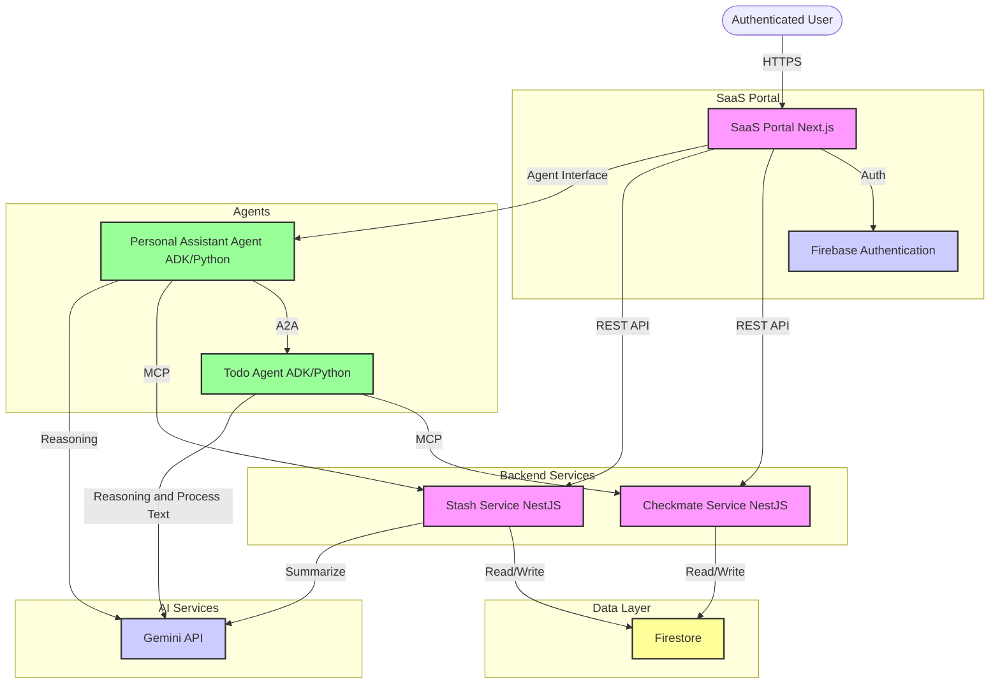

# My Personal Assistant

*This is a prototype for an internal coding contest to explore the capabilities of AI agents and microservices architecture. Most of the development is done using [Antigravity](https://antigravity.google/) and [Stich](https://stitch.withgoogle.com/)*

My Personal Assistant is a comprehensive SaaS web-based agentic application that helps you organize day-to-day tasks and chores. Built with modern cloud technologies (Cloud Run, Firestore, Vertex AI, Gemini Enterprise), AI agents (A2A, ADK), and microservices architecture (MCP, REST API).

## 📋 Table of Contents

- [Overview](#overview)
- [Architecture](#architecture)
- [Components](#components)
  - [Frontend & Portal](#frontend--portal)
  - [Backend Services](#backend-services)
  - [AI Agents](#ai-agents)
  - [Testing Tools](#testing-tools)
- [Technology Stack](#technology-stack)
- [Quick Start](#quick-start)
  - [Prerequisites](#prerequisites)
  - [Installation](#installation)
  - [Running Locally](#running-locally)
- [Documentation](#documentation)
  - [High-Level Design](#high-level-design)
  - [Component Documentation](#component-documentation)
  - [Data Model](#data-model)
- [Project Structure](#project-structure)
- [Contributing](#contributing)
- [License](#license)

## Overview

**My Personal Assistant** is a multi-agent orchestration system that combines traditional microservices with intelligent AI agents to help users manage their daily tasks and information. The system provides:

- **Task Management** (Checkmate) - A comprehensive todo list and task organizer
- **Link Aggregator** (Stash) - Save and categorize web links with AI-powered summaries and tags
- **Dashboard** - Unified view of your day with aggregated insights
- **Intelligent Agents** - Natural language interfaces for complex operations
  - **Todo Agent** - Interprets natural language to manage tasks
  - **Personal Assistant Agent** - Orchestrates multi-domain requests across services

The architecture leverages **Google Cloud Platform**, **Firebase**, **Vertex AI**, **Gemini**, and follows modern protocols like **MCP (Model Context Protocol)** and **A2A (Agent-to-Agent)** for seamless communication between services and agents.

## Architecture



## Components

### Frontend & Portal

- **[Portal](./portal)** - Next.js web application
  - Firebase Authentication (Google Sign-in)
  - Responsive dashboard UI
  - Direct API access to Checkmate and Stash
  - Agent interface for complex operations

### Backend Services

- **[Checkmate](./checkmate)** - Task management microservice (NestJS)
  - RESTful API for CRUD operations
  - MCP server for agent integration
  - Task lists, priorities, due dates
  - OAuth 2.0 + Firebase dual authentication
  - [Design Documentation](./checkmate-design.md)

- **[Stash](./stash)** - Link aggregator microservice (NestJS)
  - Save and categorize web links
  - AI-powered summarization and tagging
  - MCP server for agent integration
  - OAuth 2.0 + Firebase dual authentication
  - [Design Documentation](./stash-design.md)

### AI Agents

- **[Todo Agent](./todo-agent)** - ADK Python agent
  - Natural language task management
  - Connects to Checkmate via MCP
  - Intelligent list resolution and priority inference
  - A2A protocol interface
  - [Design Documentation](./todo-agent-design.md)

- **[Personal Assistant Agent](./personal-assistant-agent)** - ADK Python orchestration agent
  - Root agent coordinating multiple services
  - Multi-domain request handling
  - A2A communication with Todo Agent
  - Direct MCP access to Stash
  - [Design Documentation](./personal-assistant-agent-design.md)

### Testing Tools

- **[A2A Test Client](./a2a-testclient)** - Standalone Python client
  - Google OAuth 2.0 authentication
  - Interactive chat testing for A2A agents
  - Agent card discovery testing

## Technology Stack

| Layer | Technology |
|-------|-----------|
| **Frontend** | Next.js, React, Firebase Auth |
| **Backend** | NestJS, Winston Logger |
| **Agents** | ADK (Python) |
| **Database** | Google Cloud Firestore |
| **Authentication** | Firebase Auth, OAuth 2.0 |
| **AI/LLM** | Google Vertex AI Gemini API |
| **Protocols** | MCP (Model Context Protocol), A2A (Agent-to-Agent) |
| **Infrastructure** | Google Cloud Run, GCP |
| **Communication** | REST API, Server-Sent Events (SSE), JSON-RPC |

## Quick Start

### Prerequisites

- **Node.js** 18+ and npm
- **Python** 3.14+ with `uv` or `pip`
- **Google Cloud Project** with:
  - Firestore enabled
  - Firebase Authentication configured
  - Gemini API access
- **Firebase Project** linked to GCP

### Installation

```bash
# Clone the repository
git clone https://github.com/t2tse/gcr-agentic.git
cd gcr-agentic

# Install backend services
cd checkmate && npm install && cd ..
cd stash && npm install && cd ..

# Install frontend
cd portal && npm install && cd ..

# Install agents (using uv)
cd todo-agent && uv pip install -r requirements.txt && cd ..
cd personal-assistant-agent && uv pip install -r requirements.txt && cd ..
```

### Running Locally

Each service requires its own `.env` file. Refer to individual service directories for environment variable templates.

**Start all services:**

```bash
# Use the built-in workflow for starting all apps
# See .agent/workflows/start-apps-local.md
```

**Or start services individually:**

```bash
# Backend Services
cd checkmate && npm run start:dev &
cd stash && npm run start:dev &

# Agents
cd todo-agent && make local-backend &
cd personal-assistant-agent && make local-backend &

# Frontend Portal
cd portal && npm run dev
```

Access the application at `http://localhost:3000`

## Documentation

### High-Level Design

- **[High-Level Requirements](./high-level-requirements.md)** - System overview, architecture, and requirements
- **[Firestore Data Model & Isolation](./firestore-data-model-isolation.md)** - Database schema and security strategy

### Component Documentation

**UI & Applications:**
- [Dashboard Design](./dashboard-design.md) - Central landing page design and user journeys
- [Checkmate Design](./checkmate-design.md) - Task management application design
- [Stash Design](./stash-design.md) - Link aggregator application design

**AI Agents:**
- [Todo Agent Design](./todo-agent-design.md) - Natural language task agent architecture
- [Personal Assistant Agent Design](./personal-assistant-agent-design.md) - Root orchestration agent design

**Testing & Tools:**
- [A2A Test Client](./a2a-testclient/README.md) - Agent testing tool documentation

### Data Model

Refer to [Firestore Data Model & Isolation](./firestore-data-model-isolation.md) for:
- Collection schemas (`checkmate_tasks`, `checkmate_lists`, `stash_links`)
- Security rules and data isolation strategies
- Authentication patterns (Firebase + OAuth 2.0)

## Project Structure

```
gcr-agentic/
├── checkmate/              # Task management NestJS service
├── stash/                  # Link aggregator NestJS service
├── portal/                 # Next.js frontend application
├── todo-agent/             # ADK Python agent for tasks
├── personal-assistant-agent/ # ADK Python orchestration agent
├── a2a-testclient/         # A2A protocol testing client
├── ui-design/              # UI/UX design files
├── .agent/                 # Agent workflows and rules
│   ├── workflows/          # Automated workflows
│   └── rules/              # Conditional rules
├── high-level-requirements.md
├── checkmate-design.md
├── stash-design.md
├── dashboard-design.md
├── todo-agent-design.md
├── personal-assistant-agent-design.md
├── firestore-data-model-isolation.md
└── README.md               # This file
```

