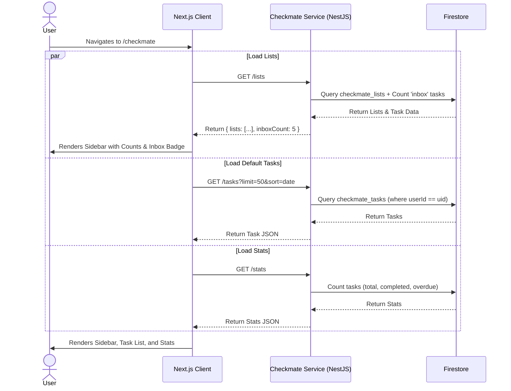
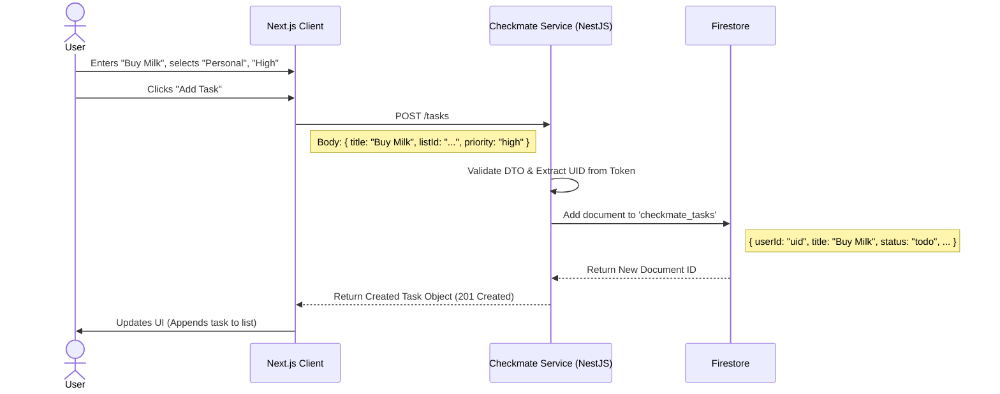
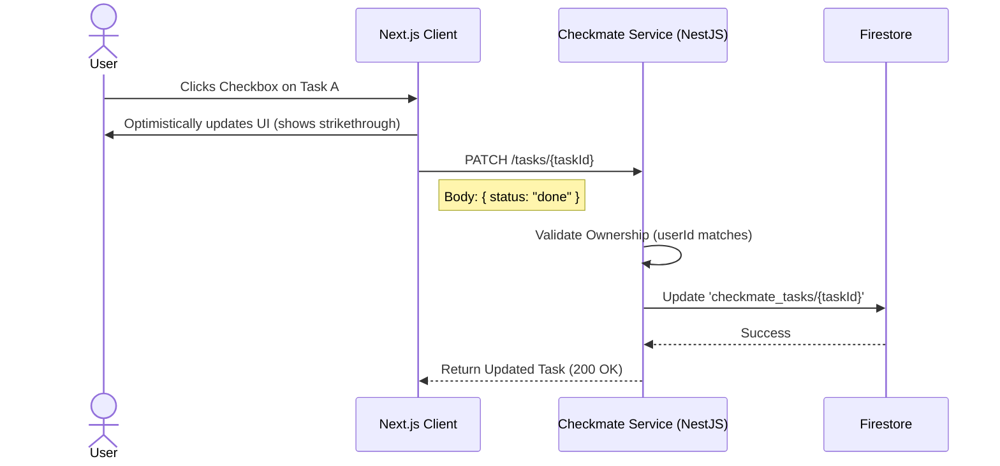
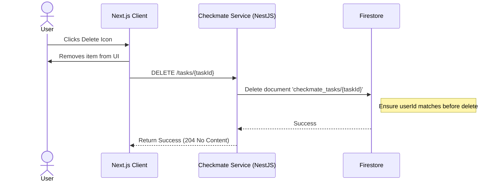
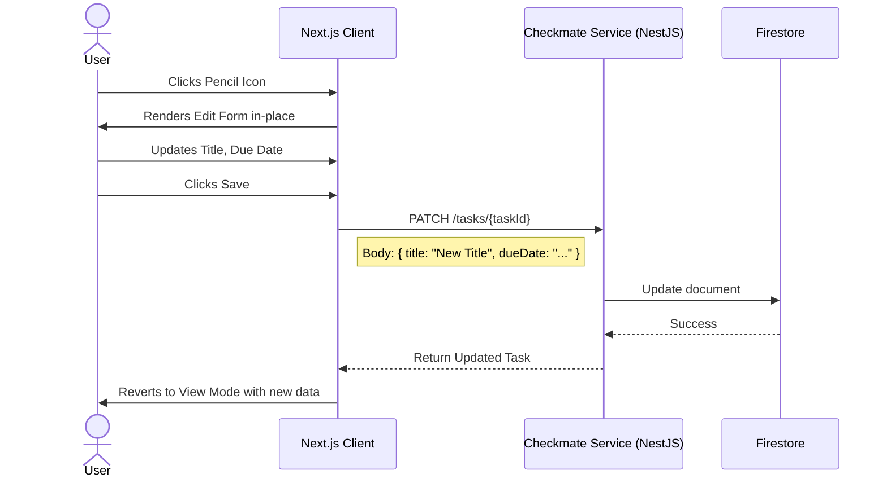
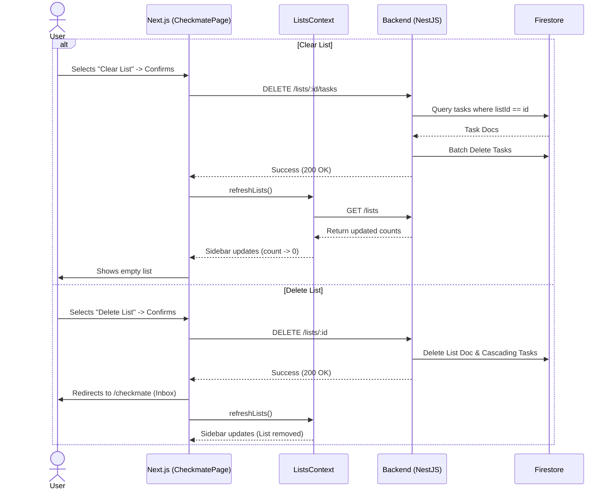

# Checkmate Application Design

This document outlines the detailed application design for **Checkmate**, the task management microservice of the Personal Assistant application.

## 1. Overview
Checkmate provides users with a comprehensive interface to manage tasks, organized by lists (e.g., Personal, Work). It supports task creation, filtering, sorting, and status tracking. The backend is built with NestJS and uses Firestore for persistence.

## 2. User Interface Design Scope
Based on the high-level requirements, the Checkmate UI supports:
*   **Sidebar**: Navigation for "Lists" with real-time task counts.
    *   **Inbox**: Default list with a persistent task count badge.
    *   **Custom Lists**: User-created lists with task count badges.
    *   **Selection State**: Correctly highlights the active list based on URL parameters.
*   **Task List View**: Main area showing tasks with:
    *   Checkbox (Status toggle)
    *   Title & Description
    *   Priority (High, Medium, Low)
    *   Due Date
    *   **Inline Editing**: Pencil icon to toggle edit mode for Title, Description, Priority, and Due Date.
*   **List Management Controls**:
    *   **Dropdown Menu** (for custom lists):
        *   **Clear List**: Remove all completed/incomplete tasks in the list.
        *   **Delete List**: Permanently remove the list and all its tasks.
    *   *Note: "Inbox" cannot be deleted or renamed.*
*   **Controls**:
    *   Filtering: All Tasks, Incomplete Only, Completed Only.
    *   Sorting: By Date, Priority.
*   **Quick Add**: Input field for rapid task creation.

## 3. Architecture & Components
*   **Frontend**: Next.js Page (`/checkmate`) calling Backend APIs.
    *   **State Management**: `ListsContext` (React Context) manages global list state (lists, inboxCount) to ensure the Sidebar stays synchronized with the main view without page reloads.
*   **Backend**: NestJS Service (`CheckmateService`, `ListsService`).
*   **Database**: Google Cloud Firestore.
    *   Collection: `checkmate_lists`
    *   Collection: `checkmate_tasks`
*   **Security**: Firebase Auth Token validation; Data isolation via `userId`.
*   **Inbox Filtering**: Backend strictly filters Inbox tasks (where `listId` is null/undefined) to prevent data leaking from other lists.

## 4. API Endpoints
The frontend interacts with the backend via the following RESTful endpoints:

| Method | Endpoint | Description | Query Params |
| :--- | :--- | :--- | :--- |
| Method | Endpoint | Description | Query Params |
| :--- | :--- | :--- | :--- |
| `GET` | `/api/checkmate/lists` | Fetch lists and `inboxCount` | - |
| `POST` | `/api/checkmate/lists` | Create a new list | - |
| `PATCH` | `/api/checkmate/lists/:id` | Update list (title, icon) | - |
| `DELETE` | `/api/checkmate/lists/:id` | Delete a list (and cascading tasks) | - |
| `DELETE` | `/api/checkmate/lists/:id/tasks` | Clear all tasks in a list | - |
| `GET` | `/api/checkmate/tasks` | Fetch tasks | `listId`, `status`, `sort` |
| `POST` | `/api/checkmate/tasks` | Create a new task | - |
| `PATCH` | `/api/checkmate/tasks/:id` | Update task (status, etc.) | - |
| `DELETE` | `/api/checkmate/tasks/:id` | Delete a task | - |
| `GET` | `/api/checkmate/stats` | Fetch summary stats | - |

## 5. User Journeys & Sequence Diagrams

### Journey 1: Loading the Checkmate Dashboard
**User Story**: As a user, I want to see my lists and tasks immediately upon opening the app, so that I can quickly understand what I need to do today.

**Acceptance Criteria**:
1.  **Sidebar Loading**:
    *   [ ] The sidebar MUST display all lists associated with the authenticated user.
    *   [ ] Each list item MUST show a count of incomplete tasks.
    *   [ ] If no lists exist, a default "Inbox" list (or system default) should be shown.
2.  **Task Loading**:
    *   [ ] The main view MUST display a list of tasks for the default selected list (or "All Tasks").
    *   [ ] Tasks MUST be sorted by `dueDate` asc and then `createdAt` desc by default.
    *   [ ] Loading skeletons or spinners MUST be shown while data is fetching.
3.  **Stats**:
    *   [ ] "Total Tasks", "Completed", and "Overdue" counters MUST accurately reflect the user's data.
4.  **Error Handling**:
    *   [ ] If the API fails, a user-friendly error message ("Failed to load tasks") MUST be displayed.

### Journey 2: Creating a New Task
**User Story**: As a user, I want to quickly add a new task with details like priority and list, so that I never forget an important action item.

**Acceptance Criteria**:
1.  **Input Validation**:
    *   [ ] Task title MUST NOT be empty.
    *   [ ] If no list is selected, it MUST default to "Inbox" (or system default).
2.  **Creation Flow**:
    *   [ ] Clicking "Add Task" (or pressing Enter) MUST send a POST request to the API.
    *   [ ] The UI MUST be updated immediately (either optimistically or after API response) to show the new task at the top or correct sort position.
    *   [ ] The input field MUST be cleared after successful submission.
3.  **Data Integrity**:
    *   [ ] The new task MUST be saved with the correct `listId` and `priority`.
    *   [ ] The `userId` MUST be securely attached by the backend (not just trust the frontend).
    *   [ ] The `createdAt` timestamp MUST be set by the backend.
    *   [ ] The `dueDate` is optional.
4.  **Side Effects**:
    *   [ ] The sidebar list count MUST increase by 1.
    *   [ ] The "Total Tasks" stat MUST increase by 1.
    *   [ ] The "Completed" stat MUST be unchanged.
    *   [ ] The "Overdue" stat MUST be unchanged unless the new task is overdue.

### Journey 3: Completing a Task
**User Story**: As a user, I want to mark tasks as done, so that I can track my progress and feel a sense of accomplishment.

**Acceptance Criteria**:
1.  **Interaction**:
    *   [ ] Clicking the checkbox MUST visually toggle the state immediately (Optimistic UI).
    *   [ ] Completed tasks MUST have a visual distinction (e.g., strikethrough text, dimmed color).
2.  **Persistence**:
    *   [ ] The change MUST be persisted to the backend via an API call.
    *   [ ] If filters are set to "Incomplete Only", the task MUST disappear from the view after a short delay or immediately.
3.  **Reversal**:
    *   [ ] Clicking a completed checkbox MUST mark the task as incomplete again.
4.  **Side Effects**:
    *   [ ] The sidebar list count MUST decrease by 1.
    *   [ ] The "Total Tasks" stat MUST be unchanged.
    *   [ ] The "Completed" stat MUST increase by 1.
    *   [ ] The "Overdue" stat MUST decrease by 1 if the task was overdue.

### Journey 4: Deleting a Task
**User Story**: As a user, I want to delete tasks that are no longer relevant, so that my list remains clean and focused.

**Acceptance Criteria**:
1.  **Interaction**:
    *   [ ] Clicking the delete icon on the task MUST remove the task from the UI immediately.
    *   [ ] A confirmation dialog or "Undo" toast MUST be displayed to prevent accidental deletion.
2.  **Persistence**:
    *   [ ] The task document MUST be permanently deleted in the backend.
3.  **Side Effects**:
    *   [ ] The sidebar list count MUST decrease by 1.
    *   [ ] The "Total Tasks" stat MUST decrease by 1.
    *   [ ] The "Completed" stat MUST decrease by 1 if the task was completed.
    *   [ ] The "Overdue" stat MUST decrease by 1 if the task was overdue.

### Journey 5: Inline Task Editing
**User Story**: As a user, I want to edit task details (Title, Description, Priority, Due Date) directly in the list, so that I can quickly correct mistakes or update plans without leaving the view.

**Acceptance Criteria**:
1.  **Interaction**:
    *   [ ] Clicking the **Pencil Icon** on a task row MUST replace the static text with input fields.
    *   [ ] The form MUST populate with existing values for Title, Description, Priority, and Due Date.
    *   [ ] Clicking "Save" (Check) MUST submit the changes and revert to view mode.
    *   [ ] Clicking "Cancel" (X) MUST revert to view mode without saving.
2.  **Persistence**:
    *   [ ] Updates MUST be persisted to the backend via `PATCH /tasks/:id`.
3.  **Validation**:
    *   [ ] Title MUST NOT be empty.

### Journey 6: List Management (Clear/Delete)
**User Story**: As a user, I want to keep my sidebar organized by removing old lists or bulk-clearing completed tasks.

**Acceptance Criteria**:
1.  **Clear List**:
    *   [ ] "Clear List" removes ALL tasks in the current list.
    *   [ ] A confirmation modal MUST be shown.
    *   [ ] The sidebar task count for that list MUST reset to 0 immediately.
    *   [ ] "Inbox" can be cleared.
2.  **Delete List**:
    *   [ ] "Delete List" removes the list and ALL its tasks.
    *   [ ] A confirmation modal MUST be shown.
    *   [ ] The user MUST be redirected to "Inbox" if the deleted list was active.
    *   [ ] The list MUST disappear from the sidebar immediately.
    *   [ ] "Inbox" CANNOT be deleted.
3.  **Synchronization**:
    *   [ ] All actions MUST trigger a `refreshLists()` context update to ensure the Sidebar stays in sync.

