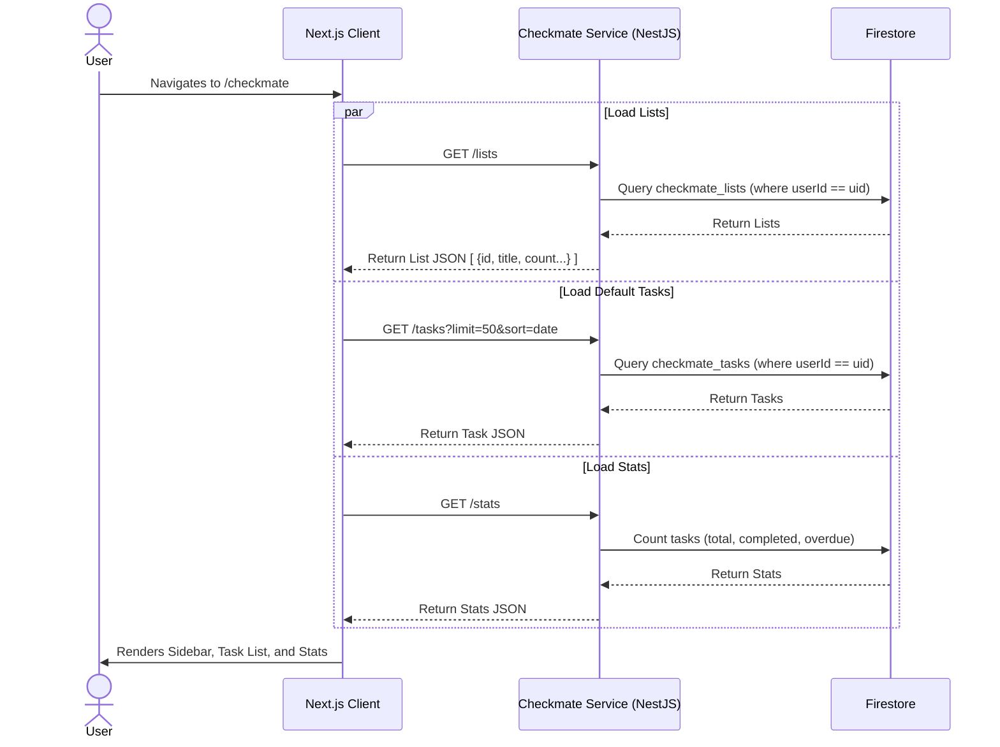
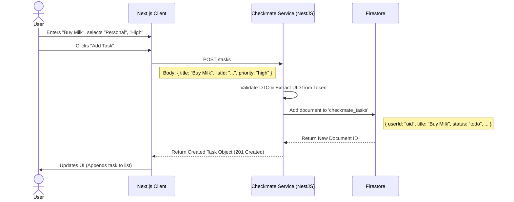
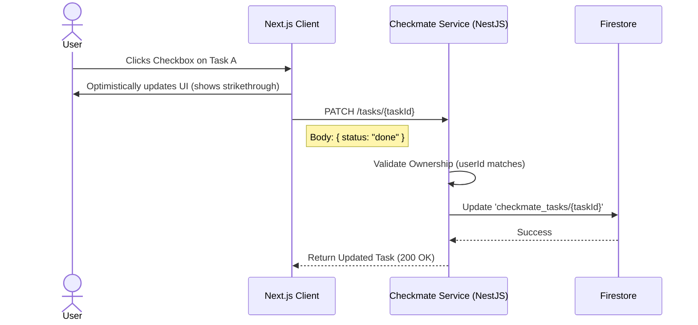
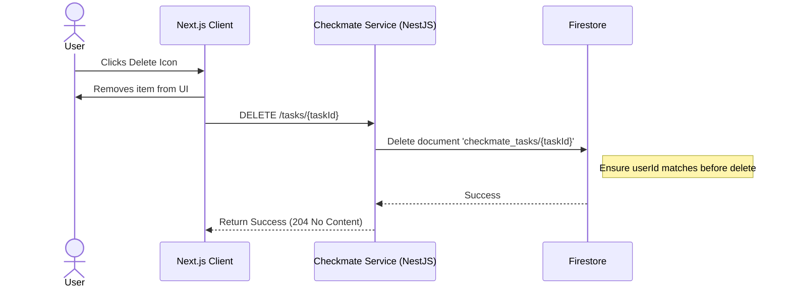

# Checkmate Application Design

This document outlines the detailed application design for **Checkmate**, the task management microservice of the Personal Assistant application.

## 1. Overview
Checkmate provides users with a comprehensive interface to manage tasks, organized by lists (e.g., Personal, Work). It supports task creation, filtering, sorting, and status tracking. The backend is built with NestJS and uses Firestore for persistence.

## 2. User Interface Design Scope
Based on the high-level requirements, the Checkmate UI supports:
*   **Sidebar**: Navigation for "Lists" with task counts.
*   **Task List View**: Main area showing tasks with:
    *   Checkbox (Status toggle)
    *   Title & Description
    *   Priority (High, Medium, Low)
    *   Due Date
*   **Controls**:
    *   Filtering: All, Incomplete, Completed.
    *   Sorting: By Date, Priority.
    *   Bulk Actions: Delete.
*   **Quick Add**: Input field for rapid task creation.

## 3. Architecture & Components
*   **Frontend**: Next.js Page (`/checkmate`) calling Backend APIs.
*   **Backend**: NestJS Service (`CheckmateService`).
*   **Database**: Google Cloud Firestore.
    *   Collection: `checkmate_lists`
    *   Collection: `checkmate_tasks`
*   **Security**: Firebase Auth Token validation; Data isolation via `userId`.

## 4. API Endpoints
The frontend interacts with the backend via the following RESTful endpoints:

| Method | Endpoint | Description | Query Params |
| :--- | :--- | :--- | :--- |
| `GET` | `/api/checkmate/lists` | Fetch all lists for sidebar | - |
| `GET` | `/api/checkmate/tasks` | Fetch tasks | `listId`, `status`, `sort` |
| `POST` | `/api/checkmate/tasks` | Create a new task | - |
| `PATCH` | `/api/checkmate/tasks/:id` | Update task (status, etc.) | - |
| `DELETE` | `/api/checkmate/tasks/:id` | Delete a task | - |
| `GET` | `/api/checkmate/stats` | Fetch summary stats | - |

## 5. User Journeys & Sequence Diagrams

### Journey 1: Loading the Checkmate Dashboard
**Goal**: User opens the Checkmate page. The system must load user-defined lists for the sidebar and the default view of tasks (e.g., "All Tasks" or "Inbox").

### Journey 2: Creating a New Task
**Goal**: User adds a new task "Buy Milk" to the "Personal" list with "High" priority.

### Journey 3: Completing a Task
**Goal**: User clicks the checkbox to mark a task as "Done".

### Journey 4: Deleting a Task
**Goal**: User deletes a task.

