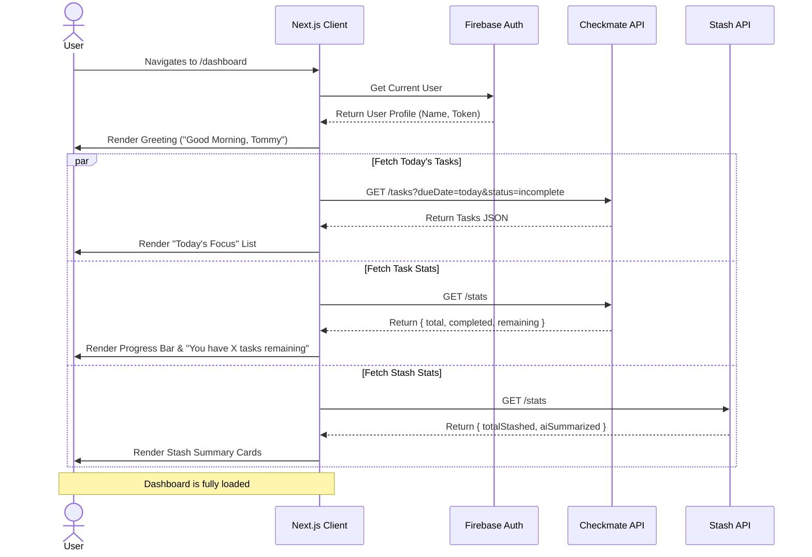
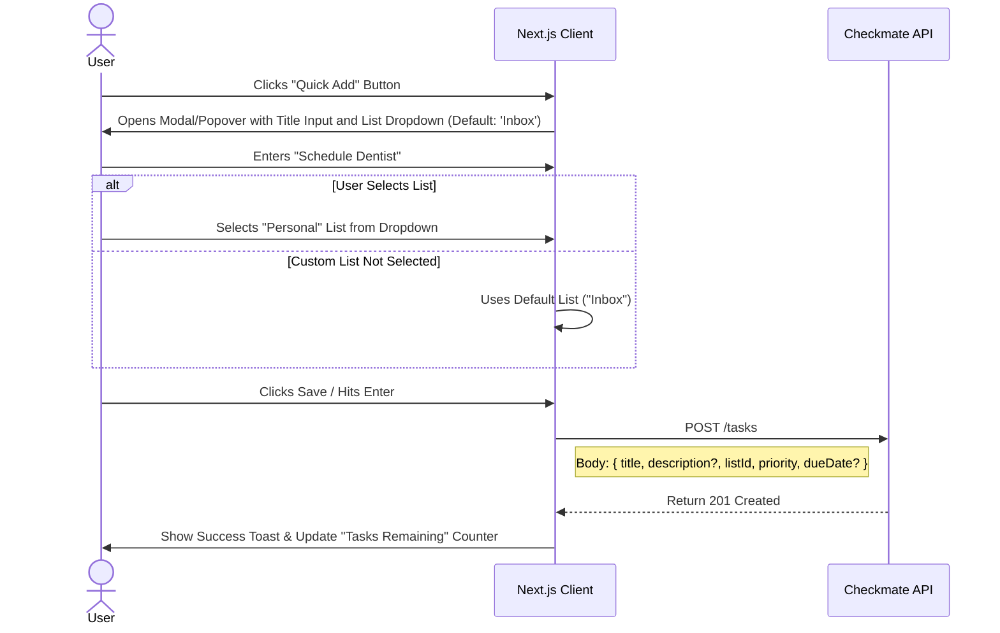

# Dashboard Application Design

This document outlines the detailed application design for the **Dashboard**, the central landing page of the Personal Assistant application.

## 1. Overview
The Dashboard serves as the command center, providing an aggregated view of the user's personal data. It connects to both **Checkmate** (for tasks) and **Stash** (for links) to present a "Start of Day" summary.

## 2. User Interface Design Scope
Based on the high-level requirements, the Dashboard UI includes:
*   **Greeting**: Personalized message ("Good Morning, [Name]") + Task Summary count.
*   **Quick Actions**: Buttons for "Quick Add Task", "Stash Link".
*   **Today's Focus**: List of high-priority/due-today tasks (from Checkmate).
*   **Statistics**: Progress bars (Completion rates).
*   **Navigation**: Links to Checkmate, Stash, and Settings.

## 3. Architecture & Components
*   **Frontend**: Next.js Page (`/dashboard`).
*   **Authentication**: Firebase Client SDK (for User Profile/Name).
*   **Backend Integrations**:
    *   **Checkmate API**: Fetches task data.
    *   **Stash API**: Fetches link stats.
    *   *Note*: The Next.js API Routes (BFF pattern) or Server Components can be used to aggregate this data server-side, or the client can fetch in parallel. For this design, we will assume Client-Side fetching for responsiveness with skeleton loaders, or Server-Side Rendering (SSR) for the initial load.

## 4. User Journey & Sequence Diagrams

### Journey 1: Loading the Dashboard
**User Story**: As a user, I want to see a personalized dashboard with aggregated data from all my apps, so that I can start my day with a clear overview.

**Acceptance Criteria**:
1.  **Personalization**:
    *   [ ] The greeting MUST include the authenticated user's first name.
    *   [ ] If the time is < 12PM, it should say "Good Morning".
    *   [ ] If the time is 12PM - 6PM, it should say "Good Afternoon".
    *   [ ] If the time is > 6PM, it should say "Good Evening".
2.  **Aggregated Data**:
    *   [ ] The "Today's Focus" list MUST show incompletion tasks due today from Checkmate.
    *   [ ] The list items MUST match the Checkmate task UI (priority flags, due dates).
    *   [ ] The list MUST support inline editing of Title, Description, Priority, and Due Date.
    *   [ ] The list MUST provide sorting options: Oldest Due Date, Priority (High-Low), Newest Created, Oldest Created.
    *   [ ] The sorting UI MUST use a custom dropdown style (white box) consistent with Stash and Checkmate.
    *   [ ] Checkmate Stats (Remaining tasks) MUST be accurate.
    *   [ ] Stash Stats (Total links) MUST be displayed.
3.  **Resilience**:
    *   [ ] If one service (e.g., Stash) is down, the Dashboard MUST still load the other components (Checkmate) gracefully.
    *   [ ] Skeleton loaders SHOULD be used during data fetching.

### Journey 2: Quick Action - Quick Add Task
**User Story**: As a user, I want to quickly add a task from the dashboard without switching context, so that I can capture ideas immediately.

**Acceptance Criteria**:
1.  **Modal Behavior**:
    *   [ ] Clicking "Quick Add" MUST open a modal or popover without navigating away.
    *   [ ] The modal MUST auto-focus the title input field.
2.  **List Selection**:
    *   [ ] A dropdown MUST be available to select the target list.
    *   [ ] The dropdown MUST default to "Inbox" (or system default).
    *   [ ] The modal MUST allow entering Description (optional), Priority (default Medium), and Due Date (optional).
3.  **Submission**:
    *   [ ] Pressing "Enter" MUST submit the task.
    *   [ ] Upon success, a toast/notification MUST appear, and the modal MUST close.
    *   [ ] The "Tasks Remaining" counter on the dashboard MUST increment immediately (Optimistic update).
    *   [ ] The Sidebar task counts (nav) MUST refresh immediately to reflect the new task.

