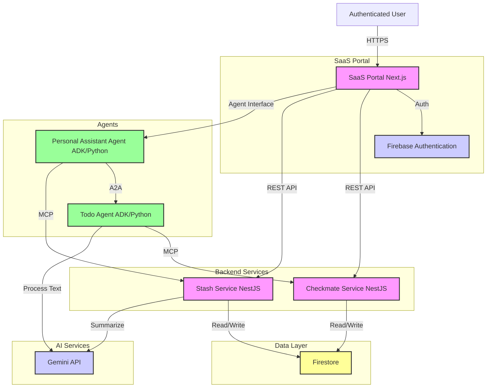

# Overview
This document captures the high level requirements for My Personal Assistant. My Personal Assistant is a SaaS web based agentic application to help human user organising day-to-day tasks and personal information. 

The complete solution consists of these microservices components:
1. Checkmate
2. Stash
3. Personal Assistant Agent
4. SaaS Portal

# Technology Stack
*   **Frontend**: Next.js (React Framework)
*   **Backend Services**: Node.js with NestJS Framework
*   **Agent Framework**: Agent Development Kit (ADK) (Python)
*   **Service Runtime**: Google Cloud Run
*   **Database**: Google Cloud Firestore (NoSQL)
*   **Authentication**: Firebase Authentication
*   **AI Models**: Google Gemini API

# Microservices Components

## Checkmate
A simple to-do or grocery checklist microservice. The todo list keep track of the status of each task and allow user to update the status of each task. Each task has a title, description, status and due date.

**Technical Requirements:**
*   Built using **NestJS**.
*   Data is stored in **Firestore**.
*   Exposed as a RESTful API.

## Stash 
A Personal Link Aggregator microservice to save and categorize web links.

**Technical Requirements:**
*   Built using **NestJS**.
*   Data is stored in **Firestore**.
*   Exposed as a RESTful API.
*   **Processing Pipeline**: Fetches content from the URL -> Sends to **Gemini API** for summarization and tagging -> Saves metadata to Firestore.

## Todo Agent
Todo Agent is an agent in a microservice that can invoke Checkmate for to-do list management. The Todo Agent is not only a passive list-keeper, it is also an intelligent assistant agent to help guide the user to extract new tasks, organise and summarise task status.

**Technical Requirements:**
*   Built using **Agent Development Kit ADK (Python)**.
*   Exposed via A2A (Agent-to-Agent) interfaces.
*   Invokes Checkmate for read/write operations via MCP (Model Context Protocol)
*   Uses **Gemini API** to process natural language input and break it down into tasks.

## Personal Assistant Agent
Personal Assistant Agent is a root orchestration agent in a microservice that can interact with Checkmate and Stash.

**Technical Requirements:**
*   Built using **Agent Development Kit ADK (Python)**.
*   Exposed via A2A (Agent-to-Agent) interfaces.
*   Interacts with the Checkmate Agent as a remote A2A agent.
*   Invokes Stash for read/write operations via MCP (Model Context Protocol)

## SaaS Portal
A landing web page for each authenticated user connecting Checkmate, Stash and Personal Assistant Agent microservices.

**Technical Requirements:**
*   Built using **Next.js**.
*   **Authentication**: Integrated with **Firebase Authentication** (Google Account Sign-in).
*   **Data Isolation**: Enforces strict user-level data isolation.
*   **Component Interaction**:
    *   **Direct Access**: Portal connects directly to Checkmate API and Stash API for standard CRUD operations (high performance).
    *   **Agentic Access**: Portal connects to Personal Assistant Agent for complex, multi-step orchestration tasks. The Agent then communicates with Checkmate and Stash.

# Non-Functional Requirements
*   **Security**: 
    *   Data encryption at rest (Firestore default) and in transit (TLS).
    *   Tenant/User isolation enforced at the API/Database level.
*   **Scalability**: Services should be stateless and deployable on serverless infrastructure (e.g., Cloud Run) to scale to zero and handle high load.
*   **Latency**: UI interactions should be responsive (<100ms). Heavy AI tasks should be handled asynchronously where possible with progressive updates.

# High-Level Architecture

