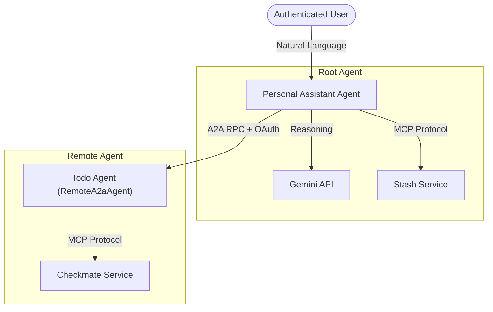
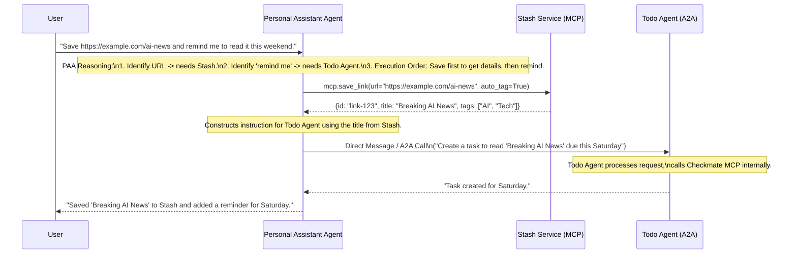

# Personal Assistant Agent Design

## 1. Overview
The Personal Assistant Agent (PAA) is the root orchestration agent for the user's personal microsystem. It acts as the primary interface for complex, multi-domain user requests, intelligently delegating tasks to specialized sub-agents (Todo Agent) or directly invoking capabilities from available services (Stash).

## 2. Architecture

The Personal Assistant Agent is implemented using the Google Agent Development Kit (ADK) in Python. It consumes the Stash API via the Model Context Protocol (MCP) and communicates with the remote Todo Agent via A2A (Agent-to-Agent) RPC.

## 3. Detailed Design

### 3.1 Agent Definition
The Personal Assistant Agent is defined as an `LlmAgent` in the ADK. It serves as a router and orchestrator.

-   **Name**: `personal_assistant_agent`
-   **Model**: `gemini-3-flash-preview` (or latest available)
-   **Description**: "The primary personal assistant. It can save links, manage tasks, and coordinate complex requests involving multiple services."
-   **Instruction**: Designed to analyze user intent and route execution to the appropriate tool or sub-agent.

### 3.2 Tools & Capabilities

1.  **Stash MCP Toolset (`StashMcp`)**:
    -   **Client Transport**: `SseConnectionParams` (Client connects via SSE to Stash's `StreamableHTTPServerTransport` at `/mcp`).
    -   **Capabilities**:
        -   `save_link`: Save a URL to Stash. Supports optional `summary` generation and `auto_tag`.
        -   `get_links`: Retrieve saved links (supporting filters/tags).
        -   `get_stats`: Retrieve usage statistics.

2.  **Todo Agent (Remote Agent)**:
    -   **Implementation**: `RemoteA2aAgent` from ADK.
    -   **Transport**: A2A RPC Protocol.
    -   **Integration**: Registered as a **sub-agent** of the PAA.
    -   **Authentication**: Uses `auth.header_provider` to forward the bearer token from the incoming request context to the remote agent call.

3.  **Standard Tools**:
    -   `get_current_time`: For context awareness.

### 3.3 Instruction Strategy
The system instruction will focus on **Intent Routing**:
*   **Link/Stash managed by Stash**: Requests involving "saving links", "bookmarks", "reading list" -> Route to `StashMcp`.
*   **Tasks/Todos managed by Todo Agent**: delegated to `todo_agent`.
*   **Hybrid Requests**: Break down complex requests.
    *   *Example*: "Save this article and remind me to read it tomorrow."
    *   *Action*:
        1. Call `StashMcp.save_link(url)`.
        2. Delegate task creation request to `todo_agent`.

## 4. Sequence Diagram: Hybrid User Journey

**Scenario**: "Save https://example.com/ai-news and remind me to read it this weekend."

## 5. Implementation Plan (Files)
The implementation will principally involve `app/agent.py` in the `personal-assistant` microservice:

1.  **Stash Integration**: Initialize `McpToolset` with `SseConnectionParams` pointing to the Stash service URL (`STASH_MCP_URL`).
2.  **Todo Agent Integration**: Implement `RemoteA2aAgent` pointing to `TODO_AGENT_URL`. Add it to `sub_agents` list of PAA.
3.  **Authentication**: Ensure the PAA service account has permissions to invoke the Todo Agent. Configure `GoogleAuth` to generate ID tokens / Access Tokens for A2A.

**Configuration**:
*   `STASH_MCP_URL`: Env var for Stash MCP endpoint.
*   `TODO_AGENT_URL`: Env var for Todo Agent A2A endpoint.
*   `GOOGLE_CLOUD_PROJECT`: For discovery/auth.

## 6. Security & Discovery

### 6.1 Agent Discovery
*   **Agent Card**: Publicly available at `.well-known/agent-card.json`.
*   **Role**: Root node. It generally consumes other agents rather than being consumed (though it could be composed into larger systems).

### 6.2 Authentication
*   **Outbound A2A & MCP**: implements **Credential Forwarding**. The PAA retrieves the bearer token from the incoming A2A request context and forwards it to downstream services (Stash via MCP, Todo Agent via A2A) to ensure operations are performed against the correct user data.
*   **Inbound**: If exposed to a UI/Portal via A2A, it implements the same `AuthMiddleware` pattern as the Todo Agent to validate incoming user requests.

### 6.3 Resilience
The agent startup process is designed to be resilient. If the downstream Stash service is unavailable or unauthenticated during the initial Agent Card build, the PAA fallbacks to a minimal "Limited" Agent Card, allowing the server to start and maintain its discovery presence.
