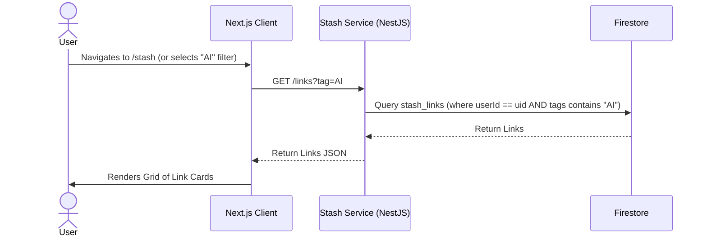
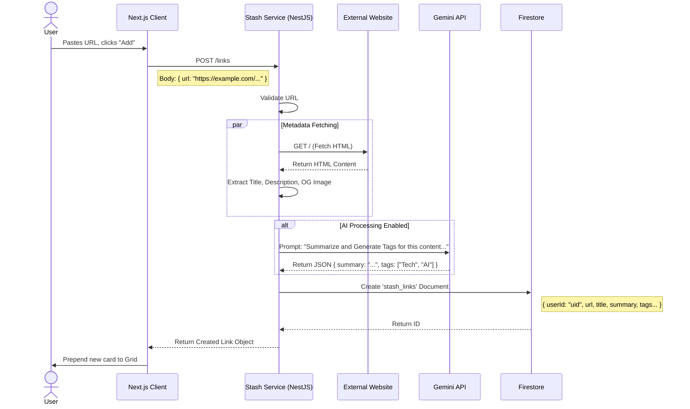
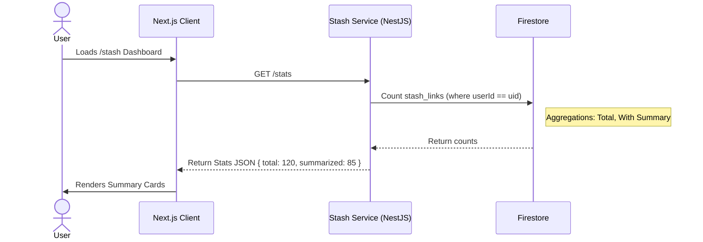
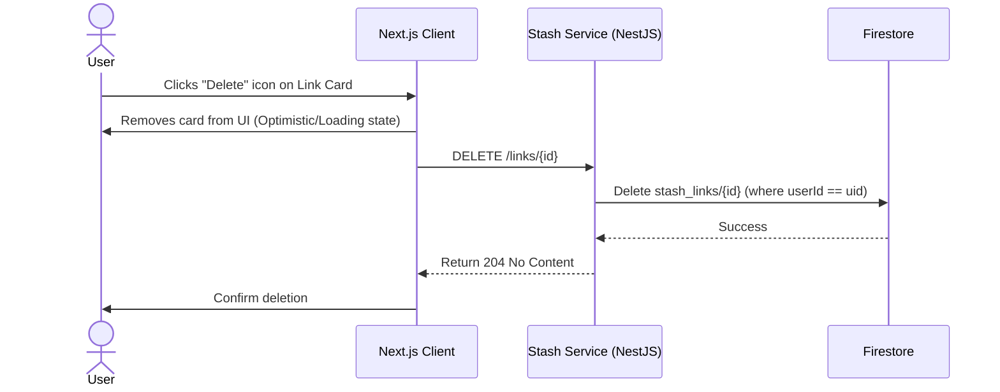

# Stash Application Design

This document outlines the detailed application design for **Stash**, the personal link aggregator microservice.

## 1. Overview
Stash allows users to save, categorize, and summarize web links. It leverages AI (Gemini) to automatically generate summaries and tags for saved content.

## 2. User Interface Design Scope
Based on the high-level requirements, the Stash UI supports:
*   **Link Views**:
    *   **Grid View**: Cards with preview image, domain, title, AI summary, and tags.
    *   **List View**: Compact rows.
*   **Controls**:
    *   **Categorization**: Dropdown filter for tags (e.g., Tech, Food).
    *   **Add Link**: Input field accepting a URL with "Auto Tag" and "Generate Summary" toggles.
*   **Stats**: Cards for "Total Stashed" and "AI Summarized".

## 3. Architecture & Components
*   **Frontend**: Next.js Page (`/stash`).
*   **Backend**: NestJS Service (`StashService`).
*   **AI Service**: Google Gemini API (via direct integration in Backend).
*   **Database**: Google Cloud Firestore.
    *   Collection: `stash_links`
*   **External**: Target URLs (for content fetching).

## 4. API Endpoints

| Method | Endpoint | Description | Query Params |
| :--- | :--- | :--- | :--- |
| `GET` | `/api/stash/links` | Fetch saved links | `tag`, `sort`, `search` |
| `POST` | `/api/stash/links` | Add a new link (triggers AI pipeline) | - |
| `DELETE` | `/api/stash/links/:id` | Delete a link | - |
| `GET` | `/api/stash/stats` | Fetch usage stats | - |

## 5. User Journeys & Sequence Diagrams

### Journey 1: Viewing Stashed Links
**Goal**: User views their collection of links, potentially filtered by a tag like "AI".

### Journey 2: Adding a Link (The AI Pipeline)
**Goal**: User pastes a URL (e.g., specific tech article) and clicks "Add". The system fetches metadata, summarizes it, and tags it.

### Journey 3: Loading Stats
**Goal**: User sees summary statistics like "Total Stashed" and "AI Summarized" on the Stash dashboard.

### Journey 4: Deleting a Link
**Goal**: User removes a saved link from their collection.

