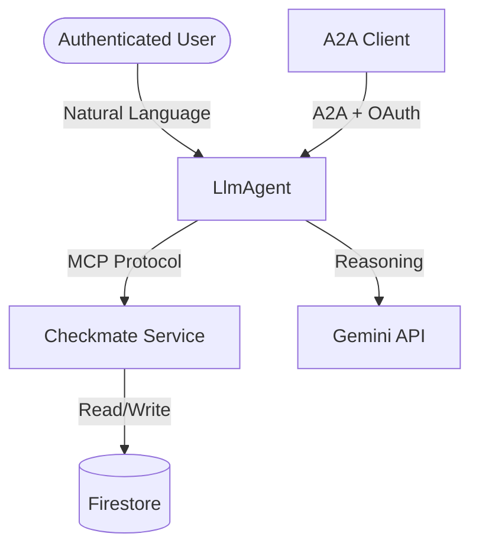
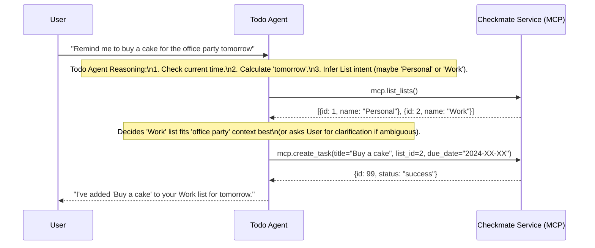

# Todo Agent Design

## 1. Overview
The Todo Agent is an intelligent agent designed to manage the user's tasks and lists by interacting with the **Checkmate** microservice. It interprets natural language requests to perform concrete interactions with the personal task manager.

## 2. Architecture

The Todo Agent is implemented using the Google Agent Development Kit (ADK) in Python. It consumes the Checkmate API via the Model Context Protocol (MCP).

## 3. Detailed Design

### 3.1 Agent Definition
The Todo Agent is defined as an `LlmAgent` in the ADK. It relies on a strong specific instruction set to interpret user intents related to task management.

-   **Name**: `todo_agent`
-   **Model**: `gemini-3-flash-preview` (or latest available)
-   **Description**: "A specialist agent for managing to-do lists and tasks. It can create, update, list, and delete tasks and task lists."

### 3.2 Tools & Capabilities
The agent's primary capability is provided through the **Model Context Protocol (MCP)** toolset, which connects it to the Checkmate service.

1.  **MCP Toolset (`CheckmateMcp`)**:
    *   **Transport**: `StreamableHTTPServerTransport` (connecting to Checkmate's `/mcp` endpoint) (Note: Agent runs in the same environment or via network, typically configured via environment variables).
    *   **Capabilities**:
        *   `list_tasks`: Filter by status, priority, or list.
        *   `create_task`: Create a new task with title, priority, due date.
        *   `update_task`: Modify existing task properties.
        *   `delete_task`: Remove a task.
        *   `list_lists`: View available task lists.
        *   `create_list`: Create a new category/list.
    *   **Authentication**: Implements **Credential Forwarding**. The agent retrieves the bearer token from the current A2A request context and dynamically injects it into outbound MCP requests via a `header_provider`. **Note**: The forwarded token must satisfy the downstream service's Audience/Authorized Party validation (i.e., issued for the correct Client ID).

2.  **Standard Tools**:
    *   `get_current_time`: Essential for resolving relative dates (e.g., "reminder tomorrow at 5pm").

### 3.3 Instruction Strategy
The system instruction for the Todo Agent will focus on:
*   **Contextual Awareness**: Always check current time for relative dates.
*   **List Resolution**: If a user specifies a list name (e.g., "Groceries"), the agent should first attempt to find that list. If it doesn't exist, it should either ask for clarification or create it (based on confidence/rules).
    *   **Special "Inbox" List**: There is a system default list called `Inbox` which cannot be deleted and does not have a `listId`. All other lists are user-defined and have a system-generated `listId` when created. Using the `Inbox` is implied when no other list matches or is specified.
*   **Priority Inference**: Infer priority (HIGH, MEDIUM, LOW) from context (e.g., "urgent", "important" -> HIGH).
*   **Output Format**: Concise confirmation of actions performed.

## 4. Sequence Diagram: "Add Task" User Journey

The following diagram illustrates the flow when a user says "Remind me to buy a cake for the office party tomorrow".

## 5. Implementation Plan (Files)
The implementation will principally involve modifying `app/agent.py` to:
1.  Initialize the `McpToolset` pointing to the Checkmate service URL.
2.  Define the `LlmAgent` with the MCP tools and the specialized instruction.
3.  Remove the boilerplate weather/time examples (keeping a robust `get_current_time`).

**Configuration**:
*   `CHECKMATE_MCP_URL`: Env var for the Checkmate MCP endpoint.
*   `GOOGLE_CLOUD_PROJECT`: For auth and service discovery.

## 6. Security & Discovery

The Todo Agent implements a robust discovery and security model to balance accessibility for the Personal Assistant Agent with strict protection of execution tools.

### 6.1 Agent Discovery (Agent Card)
*   **Base Agent Card**: Served at `{A2A_RPC_PATH}/.well-known/agent-card.json`. It is public and unauthenticated, allowing the Personal Assistant Agent to discover the Todo Agent's basic metadata (name, version, skills).
*   **Extended Agent Card**: Served via the `agent/authenticatedExtendedCard` JSON-RPC method. It requires a valid Google OAuth token and contains the detailed tool introspection data.

### 6.2 Authentication (AuthMiddleware)
The `AuthMiddleware` (FastAPI) intercepts all requests to the A2A RPC path:
1.  **Public Access**: `GET` requests (for the base Agent Card) and `OPTIONS` requests are allowed to bypass authentication.
2.  **Protected Access**: All other requests (e.g., `POST` for RPC execution) require a valid `Authorization: Bearer <token>` header.
3.  **Token Validation**: Tokens are verified using the `google-auth` library against Google's OAuth2 endpoints.
4.  **Context Propagation**: Validated tokens are stored in a `ContextVar` (`auth_token_ctx`), making them accessible to the `McpToolset` for downstream authentication.

### 6.3 Resilience
The agent startup process is designed to be resilient. If the downstream Checkmate service is unavailable or unauthenticated during the initial Agent Card build, the Todo Agent fallbacks to a minimal "Limited" Agent Card, allowing the server to start and maintain its discovery presence.
